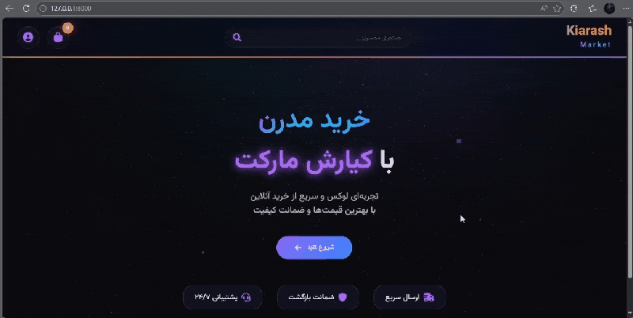

<div dir="rtl" align="center">

# 🛍️ KiarashMarket - فروشگاه آنلاین کیارش


**یک فروشگاه آنلاین کامل، حرفهای و مدرن با Django** 🚀

---

## 🎬 دموی تصویری پروژه

| بخش | نمایش |
|:---:|:---:|
| **صفحه اصلی** |  |
| **دستهبندیها** |  |
| **محصولات** |  |
| **سبد خرید** |  |
| **تسویه حساب** |  |
| **پنل مدیریت** |  |

</div>

---

## 📌 درباره پروژه

| بخش | توضیحات |
|------|---------|
| **نام پروژه** | KiarashMarket |
| **زبان برنامهنویسی** | Python 3.13 |
| **فریمورک** | Django 5.0 |
| **دیتابیس محصولات** | MongoDB Atlas |
| **دیتابیس کاربران و تراکنشها** | SQL Server |
| **وضعیت** | کامل و آماده به کار |

---

## 🛠️ معماری فنی تخصصی

### ساختار دوگانه دیتابیس

| دیتابیس | نقش | جداول/کالکشنها |
|:--------|:----|:----------------|
| **MongoDB (NoSQL)** | ذخیره محصولات و دستهبندیها | `categories`, `snacks`, `spices`, `dairy`, `drinks` (15 کالکشن) |
| **SQL Server (RDBMS)** | ذخیره اطلاعات کاربری و تراکنشها | `UserInfo`, `Cart`, `Order`, `OrderItem` |

### چرا این معماری؟

| مزیت | توضیح |
|:-----|:------|
| **مقیاسپذیری** | اضافه کردن دسته جدید بدون نیاز به مایگریشن |
| **یکپارچگی** | تراکنشهای مالی با قابلیت ACID |
| **عملکرد** | هر دیتابیس در حوزه تخصصی خود بهینه است |

---

## 🔄 فرآیند استخراج داده (Scraping)

محصولات فروشگاه با استفاده از **Selenium** و **BeautifulSoup** از فروشگاه اوکلا (Okala) اسکرپ شدهاند.

### ساختار داده محصولات

```json
{
  "name": "نام محصول",
  "price": "قیمت",
  "image_url": "آدرس عکس",
  "store": "فروشنده",
  "stock": 100
}
```

آمار استخراج شده

دستهبندی تعداد محصولات
تنقلات (Snacks) 50+
ادویه و چاشنی (Spices) 30+
لبنیات (Dairy) 40+
نوشیدنی (Drinks) 35+
میوه و سبزیجات (Fruits) 25+
خواربار (Grocery) 30+
آجیل و خشکبار (Nuts) 20+
مجموع 300+ محصول

---

✨ قابلیتهای کلیدی

برای کاربران عادی

قابلیت توضیح فنی
🔍 جستجوی زنده API با Debounce + پیشنهادات لحظهای
🛒 سبد خرید پویا آپدیت تعداد و قیمت بدون رفرش (AJAX)
💳 درگاه پرداخت شبیهسازی شده اعتبارسنجی کارت + کد امنیتی
📊 تاریخچه سفارشات نمایش همه سفارشات قبلی با جزئیات کامل
👤 پروفایل کاربری ویرایش اطلاعات + کد ملی + تاریخ تولد

برای مدیر (پنل مدیریت اختصاصی)

قابلیت توضیح فنی
📂 مدیریت دستهبندیها افزودن/ویرایش/حذف دسته در MongoDB
📦 مدیریت محصولات CRUD کامل محصولات در MongoDB
📑 گزارش فروش فیلتر بر اساس وضعیت + خروجی Excel/PDF
🔐 امنیت فقط کاربر ادمین دسترسی دارد

انیمیشنها و جلوههای ویژه

بخش تکنولوژی
پسزمینه سهبعدی Three.js (ذرات متحرک)
انیمیشنهای نرم GSAP
افکت شیشهای backdrop-filter + blur
گرادیان متحرک CSS Animation

---

🛠️ تکنولوژیهای استفاده شده

دسته تکنولوژیها
Backend Django 5.0, PyMongo, pyodbc
Frontend HTML5, CSS3, JavaScript (ES6), Three.js, GSAP
Reporting OpenPyXL, ReportLab
Scraping Selenium, BeautifulSoup

---

🚀 نصب و راهاندازی

پیشنیازها

```bash
Python 3.13+
MongoDB Atlas (یا محلی)
SQL Server 2019+
Git
```

مراحل نصب

```bash
# 1. کلون پروژه
git clone https://github.com/YOUR_USERNAME/kiarash-market.git
cd kiarash-market

# 2. ایجاد محیط مجازی
python -m venv venv
venv\Scripts\activate  # Windows

# 3. نصب وابستگیها
pip install -r requirements.txt

# 4. تنظیم دیتابیس در settings.py
# 5. اجرای مایگریشن
python manage.py makemigrations shop
python manage.py migrate

# 6. ایجاد کاربر ادمین
python manage.py createsuperuser

# 7. اجرای سرور
python manage.py runserver
```

---

🎯 مسیرهای اصلی API

متد مسیر توضیح
GET /api/cart/count/ دریافت تعداد آیتمهای سبد خرید
POST /api/cart/add/ افزودن محصول به سبد خرید
POST /api/cart/update/ بهروزرسانی تعداد محصول
GET /api/search-suggestions/?q= پیشنهادات جستجو

---

🎯 مسیرهای اصلی سایت

مسیر توضیح
/ صفحه اصلی
/categories/ دستهبندیها
/category/<slug>/ محصولات هر دسته
/cart/ سبد خرید
/checkout/ تسویه حساب
/orders/ تاریخچه سفارشات
/profile/ مشخصات فردی
/admin-panel/ پنل مدیریت اختصاصی

---

📁 ساختار پروژه

```
KiarashMarketProject/
├── shop/
│   ├── models.py
│   ├── views.py
│   ├── urls.py
│   └── mongo_utils.py
├── templates/shop/
│   ├── base.html
│   ├── home.html
│   ├── categories.html
│   ├── products.html
│   ├── cart.html
│   ├── checkout.html
│   ├── orders.html
│   ├── profile.html
│   └── admin/
├── static/
│   ├── css/
│   └── js/
├── demo/
│   ├── home.gif
│   ├── categories.gif
│   ├── products.gif
│   ├── cart.gif
│   ├── checkout.gif
│   └── admin.gif
├── requirements.txt
└── manage.py
```

---

👨💻 توسعهدهنده

Kiarash

· 🐙 GitHub: @Kiarash-sabbaghii-giit

---

📄 لایسنس

این پروژه تحت لایسنس MIT منتشر شده است.

---

<div align="center">

⭐ اگر از این پروژه خوشتان آمد، به آن ستاره دهید! ⭐

ساخته شده با ❤️ در ایران

</div> 
